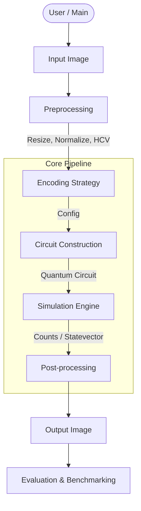

# MHRQI - Multiscale Hierarchical Representation of Quantum Images

**Author**: Keno S. Jose

A novel quantum image representation and processing framework that leverages hierarchical position encoding for multi-scale image analysis and seam-aware denoising.

---

## Overview

MHRQI introduces a **hierarchical coordinate vector (HCV)** for encoding pixel positions, enabling natural multi-scale processing within quantum circuits. The framework supports two encoding modes:

| Mode | Intensity Encoding | Use Case |
|------|-------------------|----------|
| **MHRQI** | Amplitude (rotation angle) | Probabilistic reconstruction |
| **MHRQIB** | Basis (binary qubits) | Exact intensity retrieval |

### Key Features

- **Hierarchical Position Encoding**: Quad-tree structure (for qubits) enabling multi-resolution analysis
- **Seam-Aware Denoising**: Quantum algorithms that prevent block boundary artifacts
- **Multiple Backends**: Support for Qiskit, MQT Qudits, and Decision Diagrams
- **OCT B-scan Denoising**: Targeted application for medical imaging (speckle reduction)

---

## Installation

```bash
# Clone the repository
git clone <repository-url>
cd MHRQI

# Create virtual environment (recommended)
python -m venv venv
source venv/bin/activate  # Linux/macOS
# or: venv\Scripts\activate  # Windows

# Install dependencies
pip install -r requirements.txt
```

### Requirements

- Python 3.9+
- Qiskit >= 1.0
- Qiskit Aer (GPU recommended)
- OpenCV
- NumPy, Matplotlib
- Optional: MQT Qudits, BM3D, SRAD

---

## Quick Start

```python
import main

# Run MHRQI pipeline with denoising
original, reconstructed, run_dir = main.main(
    shots=1000,           # Measurement shots
    n=8,                  # Image dimension (8x8)
    d=2,                  # Qudit dimension (2=qubit)
    denoise=True,         # Enable quantum denoising
    use_shots=True,       # Use shot-based measurement
    backend='qiskit_mhrqib',  # MHRQIB mode
    fast=True,            # Use statevector initialization
    verbose_plots=True,   # Show visualization
    run_comparison=True   # Compare with classical methods
)
```

---

## Project Structure

```
MHRQI/
├── main.py              # Main pipeline entry point
├── circuit_qiskit.py    # Qiskit circuit implementations
├── circuit_dd.py        # Decision diagram backend
├── circuit.py           # MQT Qudits backend
├── utils.py             # Helper functions (HCV, binning)
├── plots.py             # Visualization and metrics
├── compare_to.py        # Classical denoiser comparison
├── docs/
│   ├── mhrqib_encoder_math.md   # Encoder mathematics
│   ├── mhrqib_denoiser_math.md  # Denoiser mathematics
│   └── hierarchical_denoising_math.md  # Seam theory
└── runs/                # Output directory
```

---

## System Architecture

### Overall Workflow



### Subsystem Documentation

Detailed architecture and flowcharts for subsystems are available in the documentation:

- **[Circuit Construction](docs/mhrqib_encoder_math.md)**: Encoding strategy, lazy vs. gate-based upload.
- **[Denoising Logic](docs/mhrqib_denoiser_math.md)**: Phase marking, gradient sensing, and diffusion process.
- **[Benchmarking Pipeline](docs/benchmarking.md)**: Comparison methodology, metrics (FSIM, SSI, NIQE), and reporting.

---

## Mathematical Foundations

### Quantum State (MHRQIB)

$$|\text{MHRQIB}\rangle = \frac{1}{\sqrt{N^2}} \sum_{r,c} |I(r,c)\rangle_{\text{int}} \otimes |\mathbf{h}(r,c)\rangle_{\text{pos}}$$

### Hierarchical Coordinate Vector

For position $(r, c)$ in an $N \times N$ image where $N = d^L$:

$$\mathbf{h}(r,c) = (q_{y,0}, q_{x,0}, q_{y,1}, q_{x,1}, \ldots, q_{y,L-1}, q_{x,L-1})$$

### Position Diffusion Denoising

Apply $R_X(\theta)$ rotations to position qubits with scale-dependent weights:

$$\theta_k = \alpha \cdot \left(\frac{k+1}{L}\right)^2$$

See [docs/mhrqib_encoder_math.md](docs/mhrqib_encoder_math.md) and [docs/mhrqib_denoiser_math.md](docs/mhrqib_denoiser_math.md) for complete derivations.

---

## Configuration Options

| Parameter | Values | Description |
|-----------|--------|-------------|
| `backend` | `'qiskit_mhrqi'`, `'qiskit_mhrqib'`, `'dd'`, `'mqt'` | Simulation backend |
| `d` | `2`, `3`, ... | Qudit dimension |
| `denoise` | `True`, `False` | Enable quantum denoising |
| `fast` | `True`, `False` | Use statevector init (faster) |
| `use_shots` | `True`, `False` | Shot vs. statevector measurement |

---

## Benchmarking

The framework includes comprehensive benchmarking against classical denoisers:

```bash
python compare_to.py
```
v
### Metrics

| Category | Metrics |
|----------|---------|
| Full Reference | PSNR, SSIM, FSIM |
| No Reference | NIQE, PIQE, BRISQUE |
| Speckle-specific | ENL, SMPI |

### Compared Methods

- BM3D
- NL-Means
- SRAD
- Bilateral Filter

---

## Research Applications

### OCT B-scan Denoising

The framework is designed for denoising Optical Coherence Tomography (OCT) images, which suffer from speckle noise. The hierarchical representation provides:

1. **Multi-scale analysis**: Separate coarse structure from fine noise
2. **Seam-free reconstruction**: Avoid block artifacts common in hierarchical processing
3. **Pure quantum processing**: No classical post-processing required

---

## Documentation

- [Encoder Mathematics](docs/mhrqib_encoder_math.md) - Complete derivation of MHRQIB encoding
- [Denoiser Mathematics](docs/mhrqib_denoiser_math.md) - Position diffusion and seam-aware algorithms
- [Seam Theory](docs/hierarchical_denoising_math.md) - Theoretical foundations for seam prevention

---

## Citation

```bibtex
@article{jose2025mhrqi,
  title={MHRQI: Multiscale Hierarchical Representation of Quantum Images},
  author={Jose, Keno S.},
  year={2025}
}
```

---

## License

[MIT License](LICENSE)

---

## Acknowledgments

This research focuses on quantum image processing without classical post-processing, demonstrating that hierarchical quantum structures can inherently provide multi-scale denoising capabilities.
