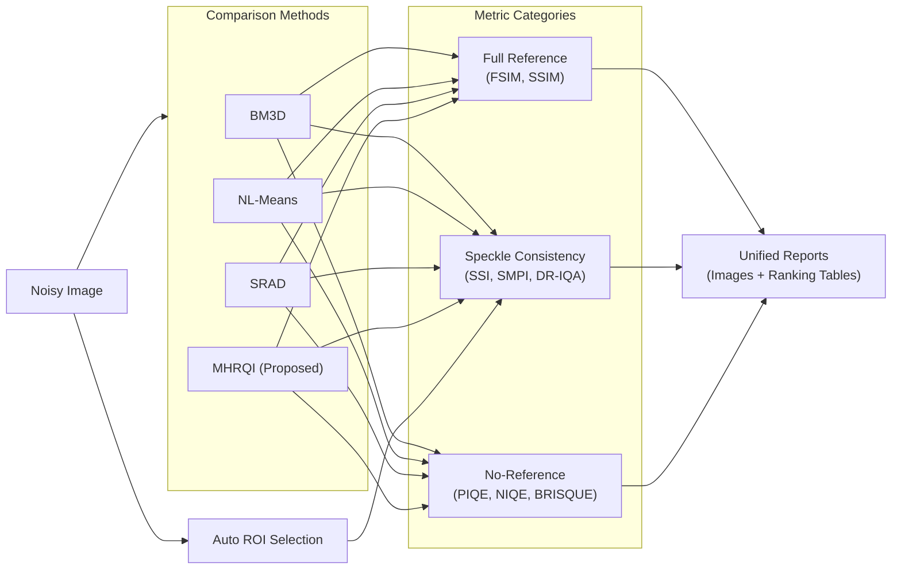

# MHRQI Benchmarking Pipeline

**Author**: Keno S. Jose  
**Project**: MHRQI - Multiscale Hierarchical Representation of Quantum Images

---

## 1. Overview

The benchmarking system evaluates the performance of the MHRQI denoiser against state-of-the-art classical methods using a comprehensive suite of image quality metrics. It categorizes evaluation into Full Reference (when a clean ground truth exists), No-Reference (for real-world quality assessment), and Speckle-Specific (for SAR/OCT consistency).

### 1.1 Pipeline Flowchart



---

## 2. Compared Methods

1.  **BM3D (Block-Matching and 3D Filtering)**
    *   State-of-the-art classical denoiser.
    *   Uses collaborative filtering in 3D transform domain.
2.  **NL-Means (Non-Local Means)**
    *   Computes weighted average of pixels with similar neighborhoods.
    *   Used as a "Clean Reference" generator when no ground truth is available.
3.  **SRAD (Speckle Reducing Anisotropic Diffusion)**
    *   PDE-based approach specifically designed for speckle noise (ultrasound/radar).
4.  **MHRQI/MHRQIB (Proposed)**
    *   Quantum algorithm using hierarchical position diffusion and phase marking.

---

## 3. Metric Definitions

### 3.1 Full Reference Metrics
*Requires a clean ground truth image.*

*   **FSIM (Feature Similarity Index Measure)**: Computes similarity based on phase congruency and gradient magnitude. Matches human visual perception better than SSIM.
*   **SSIM (Structural Similarity Index)**: Measures similarity in luminance, contrast, and structure.

### 3.2 Speckle & Consistency Metrics
*Compares denoised output against the original NOISY input to ensure structure preservation.*

*   **SSI (Speckle Suppression Index)**:
    $$SSI = \frac{\sqrt{\text{Var}(I_{filt})} / \text{Mean}(I_{filt})}{\sqrt{\text{Var}(I_{noisy})} / \text{Mean}(I_{noisy})}$$
    Lower is better. Measured on homogeneous regions (Auto-ROI).
    
*   **SMPI (Speckle Mean Preservation Index)**:
    Measures how well the mean intensity is preserved while suppressing variance. Lower is better.
    
*   **DR-IQA (Degraded Reference Image Quality Assessment)**:
    $$\text{Score} = \text{FSIM}(I_{noisy}, I_{filt}) \times \frac{1}{1 + \text{NIQE}(I_{noisy})}$$
    Balances structural fidelity to the input (FSIM) with noise reduction.

### 3.3 No-Reference Metrics
*Assesses "naturalness" and perceptual quality without any reference.*

*   **NIQE (Naturalness Image Quality Evaluator)**: Measures deviation from statistical regularities observed in natural images. Lower is better.
*   **PIQE (Perception based Image Quality Evaluator)**: Block-wise distortion estimation. Lower is better.
*   **BRISQUE (Blind/Referenceless Image Spatial Quality Evaluator)**: SVM-based quality score. Lower is better.

---

## 4. Execution

Run the benchmark comparisons using:

```bash
python compare_to.py
```

This will:
1.  Load the default test image.
2.  Execute all denoisers.
3.  Compute metrics.
4.  Generate comparison plots and ranking tables in `runs/`.
