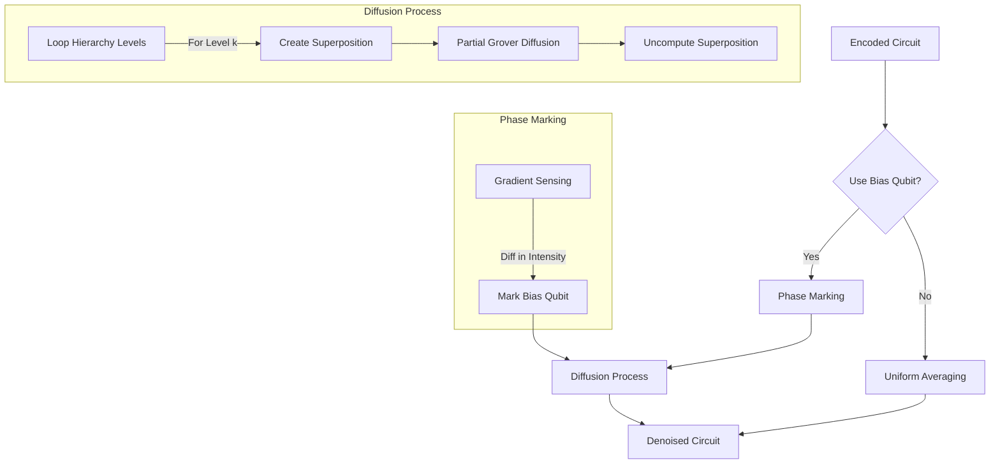

# MHRQIB Denoiser: DTQW with Edge-Preserving Anisotropic Diffusion

**Author**: Keno S. Jose  
**Project**: MHRQI - Multiscale Hierarchical Representation of Quantum Images

---

## 1. Overview

This document presents a **Discrete-Time Quantum Walk (DTQW)** based denoiser for MHRQIB that implements **edge-preserving anisotropic diffusion**. Unlike uniform averaging, this approach conditions smoothing on local intensity gradients—preserving edges while removing noise in flat regions.

---

## 2. Theoretical Foundation

### 2.1 Classical Perona-Malik Diffusion

The classical edge-preserving diffusion equation:

$$\frac{\partial I}{\partial t} = \text{div}(c(|\nabla I|) \cdot \nabla I)$$

where the **edge-stopping function**:

$$c(g) = \frac{1}{1 + (g/\kappa)^2}$$

| Gradient $g$ | $c(g)$ | Effect |
|--------------|--------|--------|
| $g \approx 0$ (flat) | $\approx 1$ | Full diffusion → smooth |
| $g \gg \kappa$ (edge) | $\approx 0$ | No diffusion → preserve |

### 2.2 Quantum Implementation Strategy

**Key Insight**: Use quantum walk to **probe neighbors** in superposition, **detect gradient magnitude**, then apply **conditional mixing**.

---

## 3. Algorithm: Hierarchical DTQW

### 3.1 Overview

```
FOR k = L-1 down to 0:  (fine to coarse levels)
    1. QUANTUM WALK: Hadamard on position qubits
    2. GRADIENT SENSING: Compute intensity difference magnitude
    3. CONDITIONAL DIFFUSION: Mix only if gradient < threshold
    4. UNCOMPUTE: Restore position qubits
```

### 3.2 Phase 1: Quantum Walk (Neighbor Superposition)

Apply Hadamard to position qubits at level $k$:

$$H|q_{y,k}\rangle \otimes H|q_{x,k}\rangle = \frac{1}{2}\sum_{j=0}^{3}|\text{neighbor}_j\rangle$$

This creates equal superposition over the current pixel and its 3 siblings at level $k$.

### 3.3 Phase 2: Multi-Bit Gradient Sensing

Compute the **Hamming distance** between current and neighbor intensity values using ancilla qubits.

For $b$-bit intensity encoding with intensity qubits $|i_{b-1}\cdots i_0\rangle$:

$$\text{gradient} = \sum_{j=0}^{b-1} |i_j \oplus i'_j|$$

where $i'_j$ represents the neighbor's intensity bit.

**Implementation**:
1. XOR each intensity bit with a gradient accumulator qubit
2. Use additional ancilla to count the number of differences
3. Threshold: if count ≤ $\tau$, mark as "safe to smooth"

**Simplified Approach** (parity-based):
$$\text{gradient\_parity} = \bigoplus_{j=0}^{b-1} i_j$$

If parity = 0 after neighbor superposition → intensities are similar → safe to smooth.

### 3.4 Phase 3: Conditional Diffusion

Apply position mixing **only when gradient is low**:

$$CR_X(\theta)|g\rangle|q\rangle = \begin{cases}
R_X(\theta)|q\rangle & \text{if } g = |0\rangle \text{ (safe)} \\
|q\rangle & \text{if } g = |1\rangle \text{ (edge)}
\end{cases}$$

This implements the edge-stopping function in quantum form.

### 3.5 Phase 4: Uncompute

Preserve reversibility by uncomputing:
1. Gradient sensing (reverse XOR chain)
2. Neighbor superposition (Hadamard again)

---

## 4. Multi-Scale Weight Schedule

### 4.1 Level-Dependent Mixing Strength

$$\theta_k = \alpha \cdot w_k$$

| Level | Weight $w_k$ | Interpretation |
|-------|--------------|----------------|
| Fine ($k = L-1$) | 1.0 | Aggressive noise removal |
| Middle | $((k+1)/L)^2$ | Moderate smoothing |
| Coarse ($k = 0$) | $(1/L)^2$ | Gentle seam blending |

### 4.2 Seam Prevention

The quantum walk at coarse levels naturally couples sibling blocks:

$$H|q_{y,0}\rangle \rightarrow \frac{1}{\sqrt{2}}(|0\rangle + |1\rangle)$$

This mixes the top and bottom halves of the image, eliminating seams.

---

## 5. Circuit Implementation

### 5.1 Register Allocation

| Register | Qubits | Purpose |
|----------|--------|---------|
| Position | $2L$ | Hierarchical coordinates |
| Intensity | $b$ | Binary intensity (typically 8) |
| Gradient | 1 | Gradient parity accumulator |
| Edge flag | 1 | Edge detection output |
| AND ancilla | 1 | Multi-controlled decomposition |

**Total**: $2L + b + 3$ qubits

### 5.2 Pseudocode

```python
def DTQW_DENOISER(qc, pos_regs, intensity_reg, strength):
    L = len(pos_regs) // 2
    
    for k in reversed(range(L)):  # Fine to coarse
        qy, qx = pos_regs[2*k][0], pos_regs[2*k+1][0]
        weight = ((k + 1) / L) ** 2
        angle = strength * weight
        
        # 1. Quantum walk: superpose with neighbors
        qc.h(qy)
        qc.h(qx)
        
        # 2. Gradient sensing: XOR intensity bits
        qc.reset(gradient_qubit)
        for int_q in intensity_reg:
            qc.cx(int_q, gradient_qubit)
        
        # 3. Conditional diffusion: mix only if gradient=0
        qc.x(gradient_qubit)  # Flip: 1 = safe
        qc.crx(angle, gradient_qubit, qy)
        qc.crx(angle, gradient_qubit, qx)
        qc.x(gradient_qubit)  # Restore
        
        # 4. Uncompute gradient
        for int_q in reversed(intensity_reg):
            qc.cx(int_q, gradient_qubit)
        
        # 5. Uncompute neighbor superposition
        qc.h(qx)
        qc.h(qy)
    
    return qc
```

### 5.3 Algorithm Flowchart



---

## 6. Comparison with Previous Approaches

| Aspect | Uniform Averaging | DTQW Edge-Preserving |
|--------|-------------------|----------------------|
| Edge handling | ❌ Diffuses edges | ✅ Preserves edges |
| Flat regions | ✅ Smooths | ✅ Smooths |
| Seams | ⚠️ Weak coupling | ✅ Full DTQW at all levels |
| Gate count | $O(L)$ | $O(L \cdot b)$ |

---

## 7. Key Equations Summary

| Concept | Equation |
|---------|----------|
| Edge-stopping function | $c(g) = 1/(1 + (g/\kappa)^2)$ |
| Quantum walk | $H^{\otimes 2}\|q_{y,k}, q_{x,k}\rangle \rightarrow$ neighbor superposition |
| Gradient parity | $g = \bigoplus_j i_j$ after neighbor superposition |
| Conditional mixing | $CR_X(\theta)\|0\rangle\|q\rangle = R_X(\theta)\|q\rangle$ |
| Level weight | $w_k = ((k+1)/L)^2$ |
