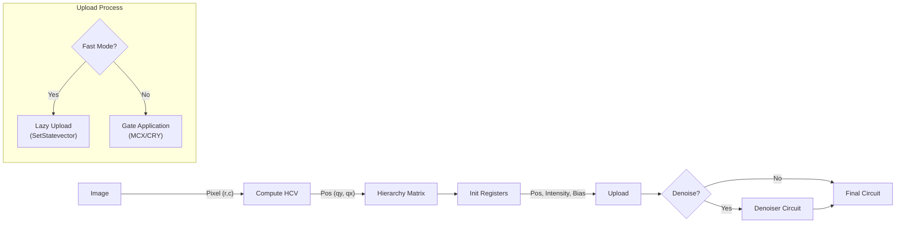

# MHRQIB Encoder: Mathematical Foundations

**Author**: Keno S. Jose  
**Project**: MHRQI - Multiscale Hierarchical Representation of Quantum Images

---

## 1. Overview

MHRQIB (Multiscale Hierarchical Representation of Quantum Images - Basis mode) encodes classical grayscale images into quantum states using **basis encoding** for intensity values. Unlike MHRQI which uses amplitude encoding (rotation angles), MHRQIB stores pixel intensities directly as binary strings in computational basis states.

---

## 2. Quantum State Representation

### 2.1 Complete State Definition

For an $N \times N$ image where $N = d^L$:

$$|\text{MHRQIB}\rangle = \frac{1}{\sqrt{N^2}} \sum_{r=0}^{N-1} \sum_{c=0}^{N-1} |I(r,c)\rangle_{\text{int}} \otimes |\mathbf{h}(r,c)\rangle_{\text{pos}}$$

where:
- $|I(r,c)\rangle_{\text{int}}$ is the intensity encoded in $b$ qubits (typically $b=8$ for 8-bit grayscale)
- $|\mathbf{h}(r,c)\rangle_{\text{pos}}$ is the hierarchical position encoding

---

## 3. Hierarchical Position Encoding

### 3.1 Coordinate Decomposition

Given pixel position $(r, c)$, the **Hierarchical Coordinate Vector (HCV)** is:

$$\mathbf{h}(r,c) = (q_{y,0}, q_{x,0}, q_{y,1}, q_{x,1}, \ldots, q_{y,L-1}, q_{x,L-1})$$

where each $q_{y,k}, q_{x,k} \in \{0, 1, \ldots, d-1\}$ represents the $k$-th level qudit value.

### 3.2 Coordinate Recovery

From HCV, the original coordinates are recovered as:

$$r = \sum_{k=0}^{L-1} q_{y,k} \cdot d^{L-1-k}$$

$$c = \sum_{k=0}^{L-1} q_{x,k} \cdot d^{L-1-k}$$

### 3.3 Example: 4×4 Image with $d=2$, $L=2$

| $(r,c)$ | HCV $(q_{y,0}, q_{x,0}, q_{y,1}, q_{x,1})$ | Position Ket |
|---------|---------------------------------------------|--------------|
| (0,0) | (0, 0, 0, 0) | $\|0000\rangle$ |
| (0,1) | (0, 0, 0, 1) | $\|0001\rangle$ |
| (1,0) | (0, 0, 1, 0) | $\|0010\rangle$ |
| (1,1) | (0, 0, 1, 1) | $\|0011\rangle$ |
| (2,2) | (1, 1, 0, 0) | $\|1100\rangle$ |
| (3,3) | (1, 1, 1, 1) | $\|1111\rangle$ |

---

## 4. Intensity Basis Encoding

### 4.1 Binary Representation

For a $b$-bit intensity value $I \in \{0, 1, \ldots, 2^b - 1\}$:

$$I = \sum_{j=0}^{b-1} i_j \cdot 2^j$$

The intensity qubit state is:

$$|I\rangle = |i_{b-1} i_{b-2} \ldots i_1 i_0\rangle$$

### 4.2 Intensity Range Mapping

For normalized input image $\tilde{I}(r,c) \in [0, 1]$:

$$I(r,c) = \lfloor \tilde{I}(r,c) \cdot (2^b - 1) \rfloor$$

**Example** ($b = 8$): A normalized value of $\tilde{I} = 0.5$ maps to $I = \lfloor 0.5 \times 255 \rfloor = 127 = \text{0b01111111}$

---

## 5. Circuit Construction

### 5.1 Register Allocation

| Register | Qubits | Purpose |
|----------|--------|---------|
| Position | $2L$ | Hierarchical coordinates (interleaved $q_y$, $q_x$) |
| Intensity | $b$ | Binary intensity value |
| AND Ancilla | 1 | Multi-controlled gate decomposition |
| Work | 2 | DTQW/diffusion operations |

**Total qubits**: $2L + b + 3$

### 5.2 Construction Workflow

### 5.3 Position Superposition

Initialize all pixels in uniform superposition:

$$H^{\otimes 2L} |0\rangle^{\otimes 2L} = \frac{1}{\sqrt{2^{2L}}} \sum_{\mathbf{h}} |\mathbf{h}\rangle$$

### 5.4 Intensity Upload (Gate-Based)

For each pixel with HCV $\mathbf{h}$ and intensity $I$:

1. Prepare controls: Flip qubits where $q_k = 0$
2. Apply MCX to AND ancilla
3. For each bit $i_j = 1$: Apply CX from AND ancilla to intensity qubit $j$
4. Uncompute MCX
5. Restore controls

**Mathematical Operation**:

$$\text{MCX}_{[\mathbf{h}]}|0\rangle_{\text{anc}} = |1\rangle_{\text{anc}} \quad \text{iff position} = \mathbf{h}$$

$$\text{CX}_{\text{anc} \to j}|0_j\rangle = |i_j\rangle \quad \text{(conditioned on ancilla)}$$

### 5.5 Fast Upload (Statevector Initialization)

Directly construct the statevector:

$$\text{sv}[\text{idx}] = \frac{1}{\sqrt{N^2}}$$

where:
$$\text{idx} = \text{pos\_bits} \| \text{intensity\_bits}$$

This bypasses gate synthesis entirely for simulation, providing $O(N^2)$ vs $O(N^2 \cdot 2L \cdot b)$ gate complexity.

---

## 6. Measurement and Reconstruction

### 6.1 Computational Basis Measurement

Measure all qubits in computational basis. For each shot:
- Position bits → pixel coordinates $(r, c)$
- Intensity bits → pixel value $I$

### 6.2 Statistical Reconstruction

From $S$ measurement shots:

$$\hat{I}(r,c) = \frac{1}{N_{r,c}} \sum_{\text{shots at } (r,c)} I_{\text{measured}}$$

where $N_{r,c}$ is the count of shots landing at position $(r, c)$.

### 6.3 Expected Shot Distribution

Due to uniform position superposition:

$$P(\text{position} = \mathbf{h}) = \frac{1}{N^2}$$

Expected shots per pixel: $\mathbb{E}[N_{r,c}] = \frac{S}{N^2}$

---

## 7. Comparison: MHRQIB vs MHRQI vs NEQR

| Property | MHRQIB | MHRQI | NEQR |
|----------|--------|-------|------|
| Intensity Encoding | Basis (binary) | Amplitude (angle) | Basis (binary) |
| Position Encoding | Hierarchical | Hierarchical | Flat (binary) |
| Qubits (8-bit, $N \times N$) | $2\log_d N + 8 + 3$ | $2\log_d N + 1$ | $2\log_2 N + 8$ |
| Native Hierarchy | ✓ | ✓ | ✗ |
| Exact Intensity | ✓ | ✗ (statistical) | ✓ |
| Denoising Advantage | Seam-aware diffusion | Multi-scale rotation | Flat QFT filters |

---

## 8. Key Equations Summary

| Concept | Equation |
|---------|----------|
| Full quantum state | $\|\text{MHRQIB}\rangle = \frac{1}{\sqrt{N^2}} \sum_{r,c} \|I(r,c)\rangle \otimes \|\mathbf{h}(r,c)\rangle$ |
| HCV definition | $\mathbf{h}(r,c) = (q_{y,0}, q_{x,0}, \ldots, q_{y,L-1}, q_{x,L-1})$ |
| Row from HCV | $r = \sum_{k=0}^{L-1} q_{y,k} \cdot d^{L-1-k}$ |
| Intensity encoding | $\|I\rangle = \|i_{b-1} \ldots i_0\rangle$ where $I = \sum_j i_j 2^j$ |
| Total qubits | $n_{\text{total}} = 2L + b + 3$ |
